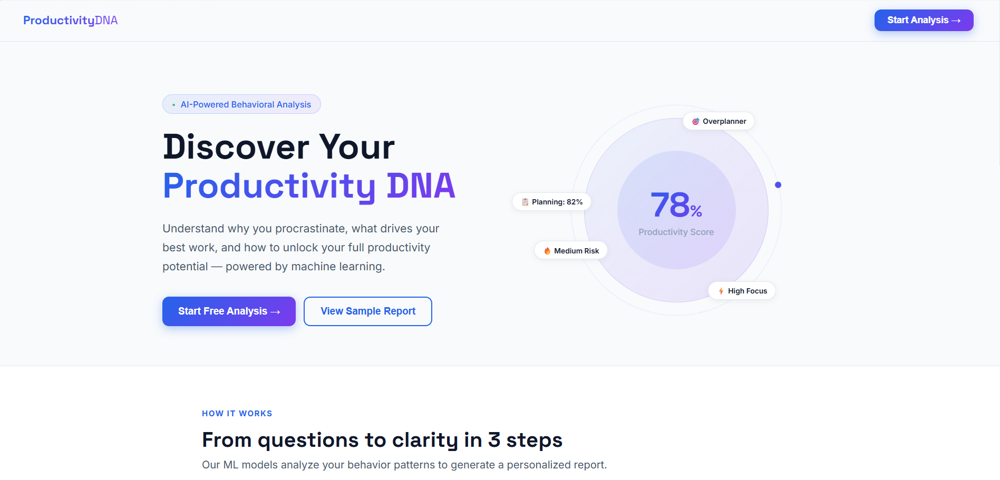
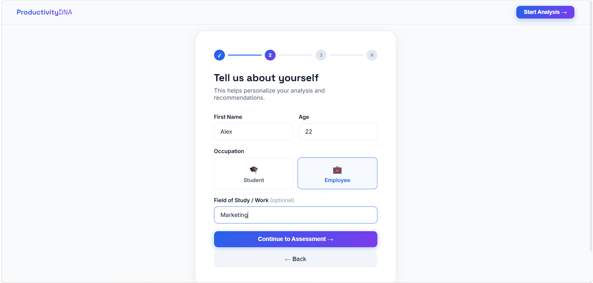
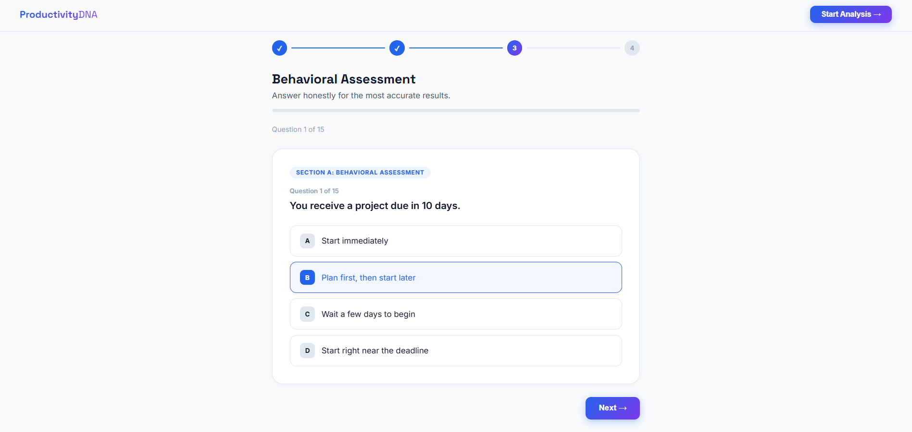
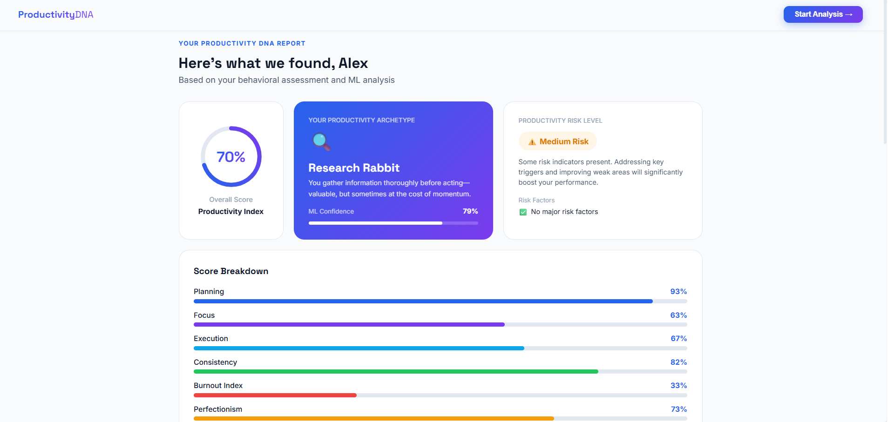
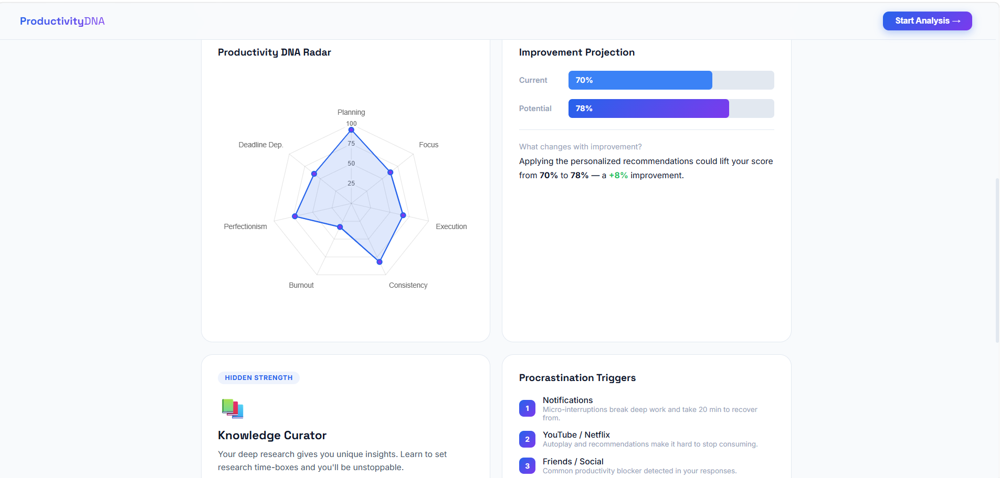

# Productivity DNA Analyzer

### AI-Powered Productivity Personality & Procrastination Intelligence Platform

Productivity DNA Analyzer is a Machine Learning-inspired web application that helps students and employees understand their productivity behavior, identify procrastination triggers, and receive personalized recommendations through behavioral analysis.

The platform evaluates user responses, analyzes productivity patterns, predicts productivity archetypes, and generates a comprehensive Productivity DNA Report to help users improve their work habits and overall productivity.

---

## Features

- 📋 Interactive Productivity Assessment
- 🧠 Productivity Behavior Analysis
- 🎭 Productivity Archetype Identification
- ⚠️ Productivity Risk Assessment
- 📊 Visual Productivity Dashboard
- 📈 Productivity Score Calculation
- 🔍 Trigger Detection & Analysis
- 🎯 Personalized Recommendations
- 📄 Downloadable Productivity Report

---

## Problem Statement

Students and employees often face challenges such as:

- Procrastination
- Lack of Focus
- Poor Time Management
- Inconsistent Work Habits
- Burnout
- Missed Deadlines

Most productivity tools focus on task tracking and scheduling but fail to identify the behavioral causes behind productivity issues.

Productivity DNA Analyzer addresses this problem by providing behavioral insights and personalized recommendations to help users understand and improve their productivity.

---

## Workflow

```text
User Registration
        ↓
Productivity Assessment
        ↓
Behavior Analysis
        ↓
Productivity Scoring
        ↓
Archetype Identification
        ↓
Risk Assessment
        ↓
Recommendation Generation
        ↓
Productivity Dashboard
        ↓
Report Generation
```

---

## Productivity Archetypes

The system identifies different productivity personalities, including:

- Overplanner
- Perfectionist
- Last-Minute Hero
- Consistent Builder
- Distracted Explorer
- Busy Procrastinator
- Burned-Out Achiever
- Research Rabbit

Each archetype represents unique productivity behaviors and work patterns.

---

## Productivity Metrics

The platform evaluates users across multiple dimensions:

| Metric | Description |
|----------|-------------|
| Planning | Ability to organize and schedule tasks |
| Focus | Ability to maintain concentration |
| Execution | Ability to complete tasks effectively |
| Consistency | Ability to sustain productivity over time |
| Burnout | Mental exhaustion level |
| Perfectionism | Tendency to over-optimize work |
| Deadline Dependence | Reliance on deadlines for motivation |

These metrics are used to generate the user's Productivity DNA Profile.

---

## Screenshots

### Landing Page


### Assessment Module



### Productivity Report



---

## Future Enhancements

- AI-Based Recommendation Engine
- User Authentication
- Assessment History Tracking

---

## Project Outcome

Productivity DNA Analyzer helps users:

✅ Understand their productivity style

✅ Identify procrastination triggers

✅ Recognize strengths and weaknesses

✅ Improve work habits through personalized recommendations

✅ Build better productivity practices

---

## Key Highlights

- Behavioral Productivity Analysis
- Interactive Assessment System
- Personalized Insights
- Productivity Dashboard
- Modern User Experience
- Student & Employee Focused

---

### ⭐ **"Understand How You Work. Improve How You Grow."**
